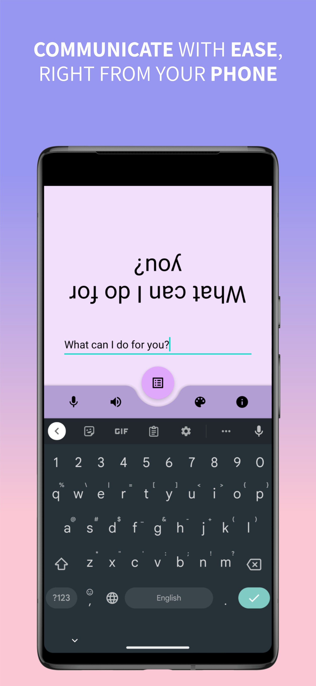
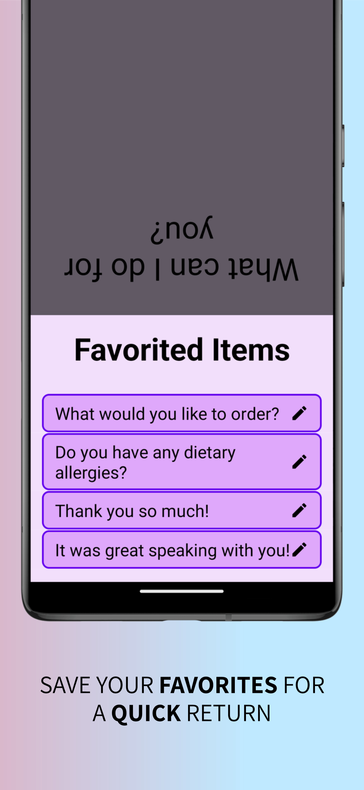
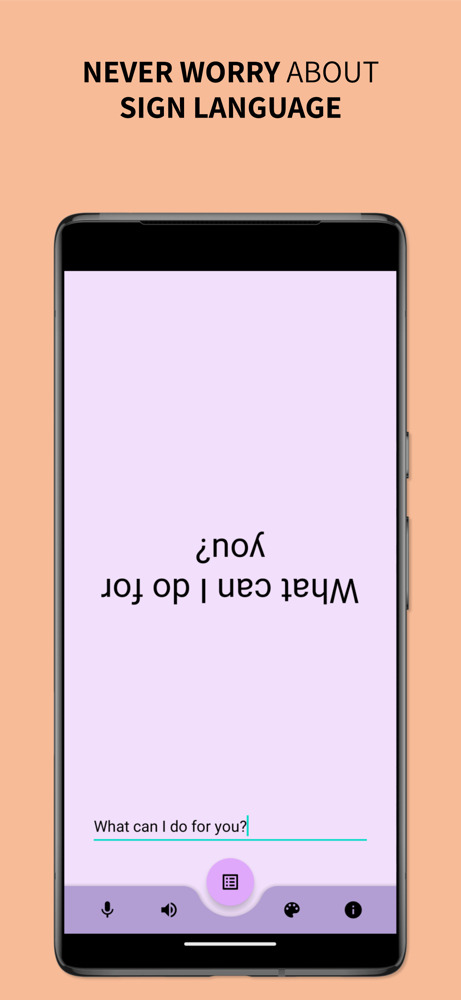
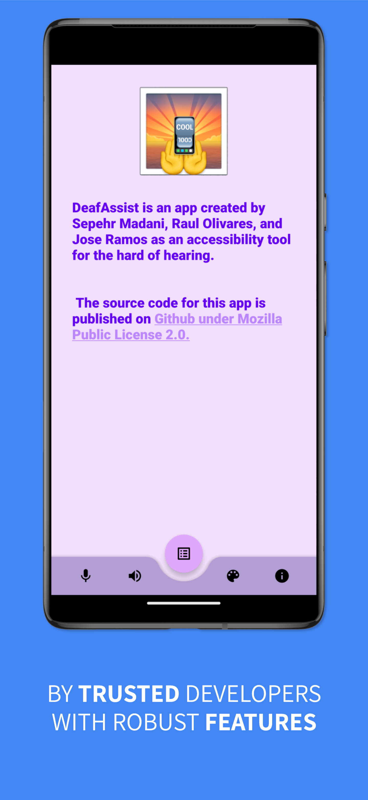

# DeafAssist-android
Course Project for Mobile App Programming I Course at UML, Fall 2022

## Mission Statement
Accessibility is an integral piece for creating any inclusive space, specifically for disabled people. One way to help achieve that is to create tools that allow for easier interactivity and navigation for the disabled. DeafAssist® intends to do just that, an app designed for assisting a hearing person with communicating with the hearing impaired without sign language.
## Project information and background  
Hearing people often have issues when they enter a conversation with a hearing-impaired person, as few know sign language.
Rather than using a bare-bone Notes app, DeafAssist provides a simple yet effective ad hoc communication interface for a hearing person to speak with a hearing-impaired individual. Various tools are provided, including:
- A large-font mirrored text display for typed notes
- An array of modules including Text-to-speech, speech-to-text, and saved “template” sentences
- List of pre-written sentences to pick from
- Display font and color customization
- View mirroring switches for people in conversation
The project will be implemented in Kotlin 1.7.20, targeting API 21 (Android Lollipop 5.0+, 98.8% device coverage). The source code will be published under Mozilla Public License 2.0.

We would like to thank our professor, Dr. Lin, for her assistance and her patience to work with us on this project.

## Possible Learning Efforts
Management of the dynamically created list of “Favorites” is something we have not done yet but it is a very common programming pattern in Android development, therefore there is great utility in learning it in practice.
Actual implementation of an exhaustive Settings page is also to be learned and carried out.

# Prototypes

### Contribution
Feel free to fork the project and add contributions by making a PR.
